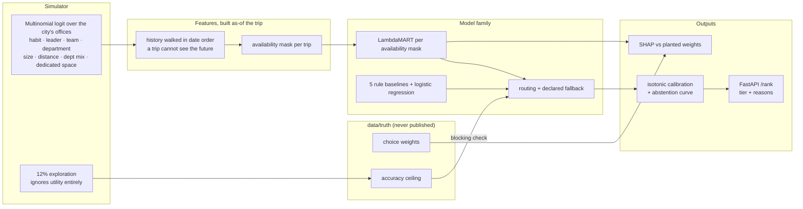
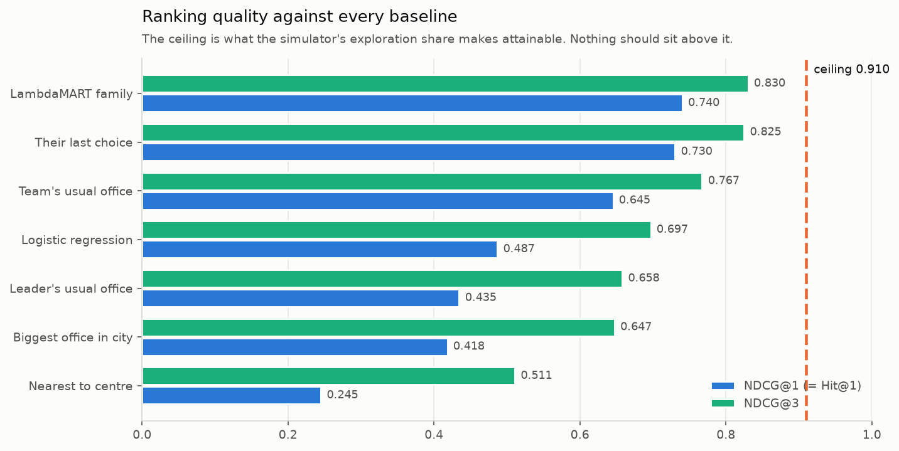
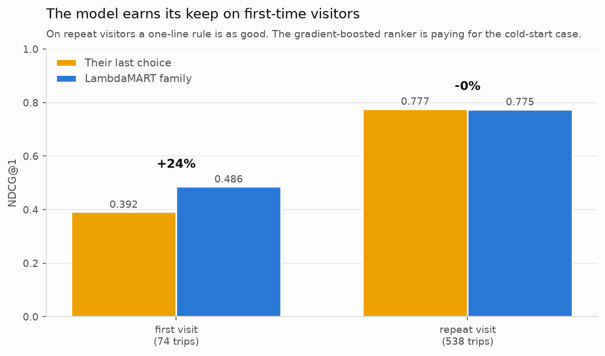
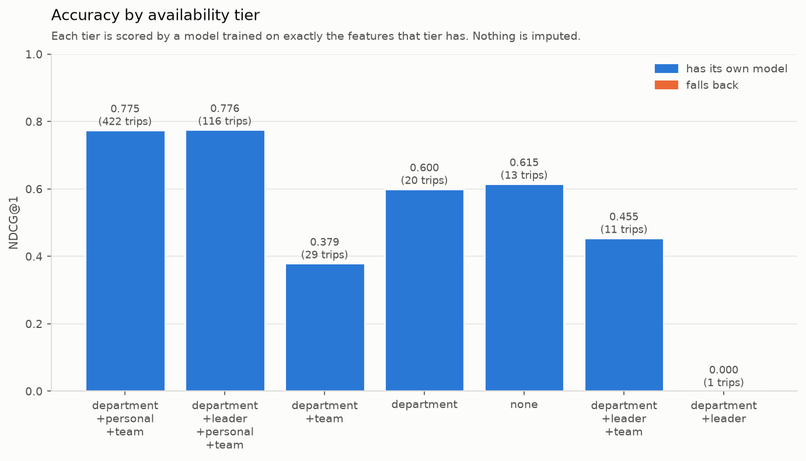
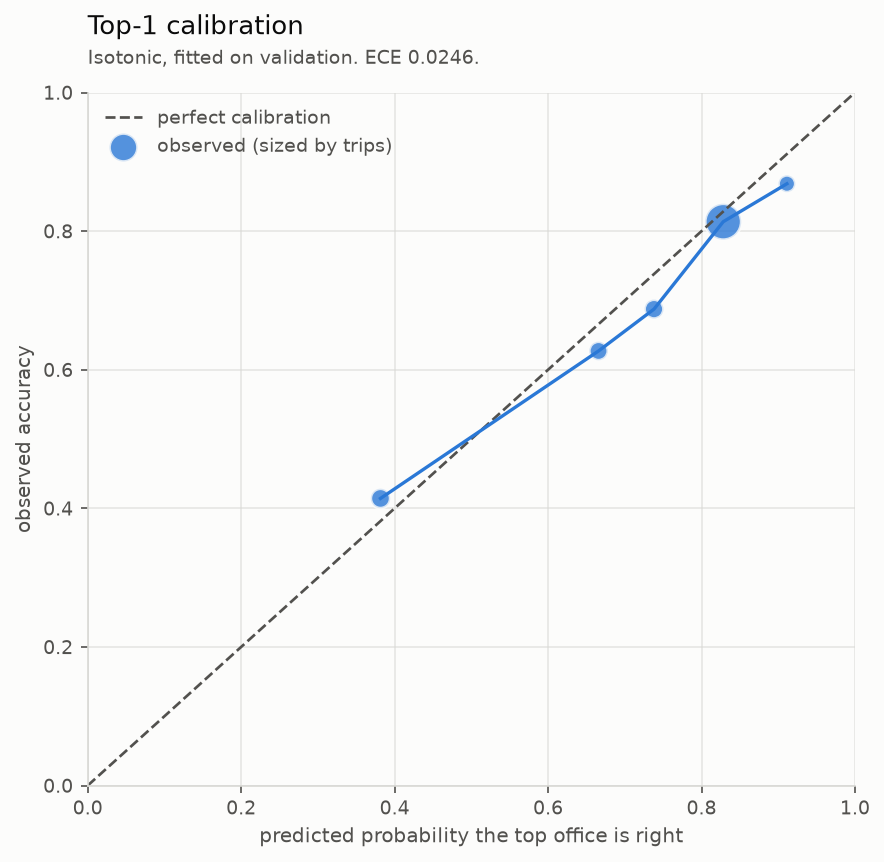
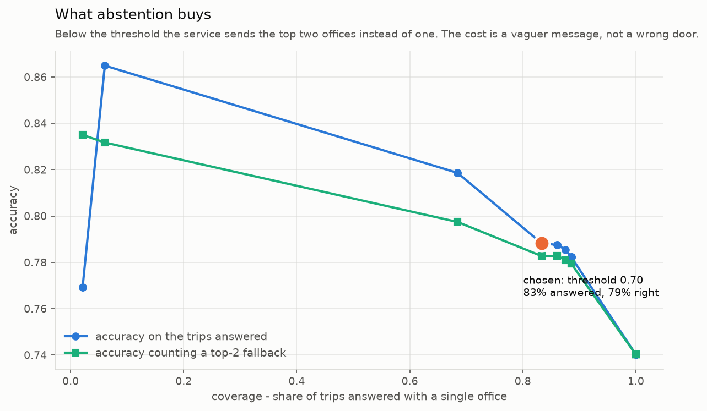
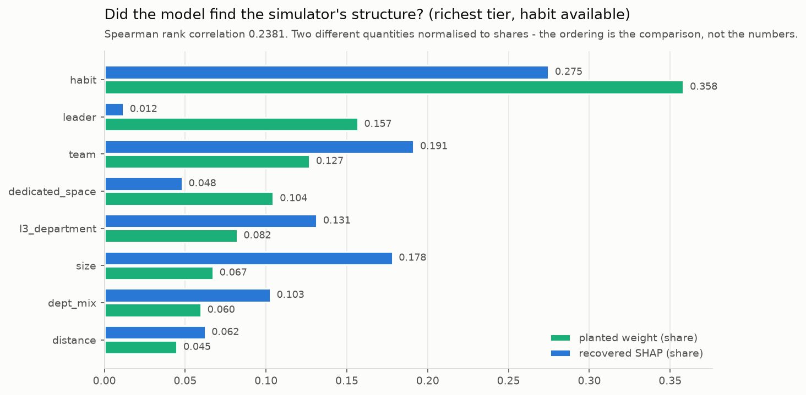
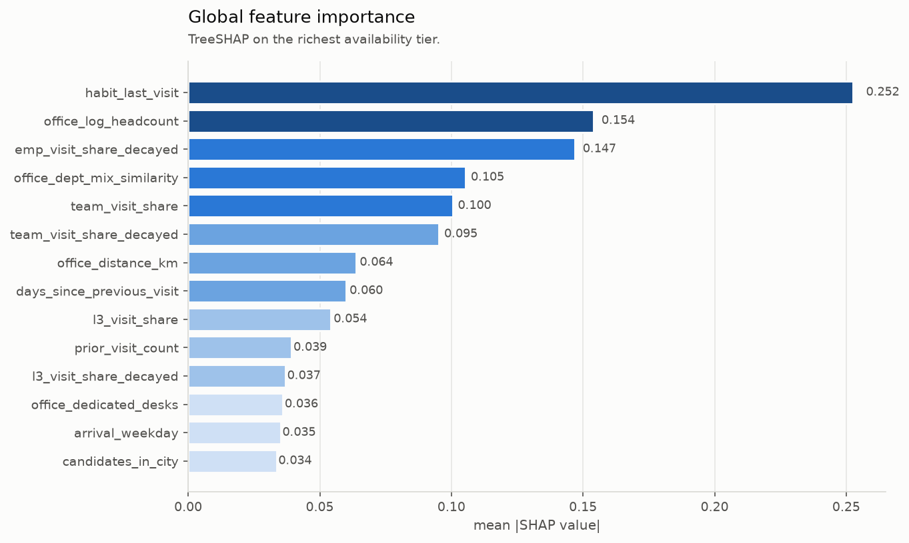

# office-visit-ranker

A learning-to-rank model that predicts which office a travelling employee will walk into, so
access, desks and catering can be prepared before they arrive - with missing features routed
around rather than imputed, and an accuracy ceiling the model is not allowed to exceed.

> **Synthetic data notice.** All data in this repository is programmatically generated. It
> contains no proprietary, confidential, or personal data, and no real operational figures.
> This is a reimplementation of analytical methodology on simulated data, built to demonstrate
> technique. Results shown are properties of the simulator, not of any organisation.

---

## Problem

An employee travels from their base city to another city with between two and twelve offices.
Before they land, workplace services wants to know which building they will actually use, so
badge access is granted for the right one, a desk is booked in the right one, and the meal
instruction names the right reception.

Two things make this harder than it sounds.

**It is a ranking problem, not a classification problem.** The service sends one instruction per
trip, with the option of naming two buildings when unsure. What matters is the order of offices
within a trip, not the calibrated probability of each - and a classifier optimising per-row log
loss is indifferent to whether the right building came first or third.

**The most predictive features are the ones most often missing.** A first-time visitor to a city
has no habit to go on. A contractor with no manager in the HR extract has no leader gravity. Those
are exactly the travellers for whom getting it wrong is most visible, and the standard fix -
impute a zero, add an indicator - quietly tells the model something false.

---

## Architecture



Orchestrated by Dagster: six assets, two blocking checks, MLflow tracking every model as a run,
a batch scoring job, and a drift monitor.

---

## Method

### 1. A simulator with a knowable ceiling

Each trip's office is drawn from a multinomial logit over that city's offices:

$$U_j = w_{\text{habit}}h_j + w_{\text{leader}}\ell_j + w_{\text{team}}t_j + w_{\text{dept}}d_j + w_{\text{size}}\tilde{s}_j + w_{\text{dist}}\tilde{x}_j + w_{\text{mix}}m_j + w_{\text{ded}}e_j + \varepsilon_j$$

with $\varepsilon_j$ Gumbel - and **12% of choices ignore $U$ entirely**. That exploration share
is irreducible error: no feature predicts it, so the attainable ceiling is knowable (0.910 here,
allowing for an exploring traveller still being right by luck at $1/n$) and is written to
`ground_truth.json`.

**Anything above that ceiling is a leak, not a better model** - and a Dagster asset check blocks
on it. This is the check a repository built on real data cannot have. (ADR 3)

Three versions of the simulator were wrong, each recorded in `conf/sim.yaml`:

- Half the trips had a single candidate office, so the headline accuracy was mostly a count of
  cities where there was nothing to get wrong.
- Leader gravity fired on **0.3%** of trips, because a manager's usual office was derived purely
  from their own travel history and managers rarely travel to the same city.
- Destinations were drawn uniformly, which left leader gravity at 4% - your manager is almost
  never in a randomly chosen city. Travellers now pick destinations weighted by their
  department's presence with a strong pull toward their manager's city, which is both the
  realistic story and what gives the feature something to do.

### 2. Features that cannot see the future

Trips are walked in date order and a trip only ever sees history accumulated before it. The
guarantee is **structural** - the history object does not contain the future - rather than a
filter somebody has to remember to apply.

Twenty-seven features across nine families: habit, personal history, leader gravity, team gravity,
department gravity, recent departmental travel, recency-decayed variants of each, office context
(size, distance, department-mix similarity, dedicated space), and trip context.

`tests/test_leakage.py` re-derives each behavioural feature by brute force against an independent
as-of computation, and asserts that no feature correlates above 0.95 with the label.

### 3. The availability contract

```
imputed zero  =>  "the manager uses none of these offices"
absent        =>  "we do not know where the manager sits"
```

Different claims. The first is unsupported by the data, and at scoring time the same zero covers
two populations that behave completely differently.

So a trip carries an **availability mask**, and is routed to a model trained on exactly the
features that mask has. Masks with fewer than 60 training trips fall back through a declared order
- leader, then department, then team, then personal, least informative first - terminating at the
empty mask, which always has a model.

| Mask | Trips | Features | Scored by | Fallback |
|---|---|---|---|---|
| department+personal+team | 2,509 (56%) | 25 | itself | - |
| department+leader+personal+team | 603 (14%) | 27 | itself | - |
| none | 480 (11%) | 12 | itself | - |
| department+team | 345 (8%) | 19 | itself | - |
| department | 294 (7%) | 16 | itself | - |
| department+leader+team | 149 (3%) | 21 | itself | - |
| leader | 52 (1%) | 14 | `none` | 1 step |
| department+leader | 27 (1%) | 18 | `department` | 1 step |

The invariant is enforced **at the moment of scoring**, not just at setup: `score()` raises if a
model would read a column the row's mask lacks. A test deliberately mislabels rich rows as empty
and asserts the raise. (ADR 2)

### 4. Calibration and abstention

A LambdaMART score is not a probability, so the **margin** between first and second - which is
comparable across trips, where the raw score is not - is mapped to one by isotonic regression
fitted on the validation window.

Below a threshold the service returns the top two offices as a tie. Access can be granted to two
buildings and a meal instruction can name two receptions: the cost is a vaguer message, not a
wrong door. The threshold comes from the published coverage/accuracy curve, not from taste.

---

## Results on synthetic data

Seed `31415`, 15,000 employees, 20 cities, 24 months, 4,459 trips, 5.5 candidate offices per trip.
Trained on months 1–18, validated on 19–21, tested on 22–24.

### Against every baseline

| Model | NDCG@1 (= Hit@1) | NDCG@3 | MRR | Recall@2 | Lift NDCG@3 |
|---|---|---|---|---|---|
| **LambdaMART family** | **0.7402** | **0.8304** | 0.8280 | 0.8366 | **+28.3%** |
| Their last choice | 0.7304 | 0.8249 | 0.8199 | 0.8219 | +27.4% |
| Team's usual office | 0.6454 | 0.7675 | 0.7644 | 0.7663 | +18.6% |
| Logistic regression | 0.4869 | 0.6970 | 0.6751 | 0.7190 | +7.7% |
| Leader's usual office | 0.4346 | 0.6580 | 0.6349 | 0.6552 | +1.6% |
| Biggest office in city | 0.4183 | 0.6474 | 0.6234 | 0.6454 | - |
| Nearest to centre | 0.2451 | 0.5109 | 0.4914 | 0.4657 | −21.1% |

**Hit@1 0.7402 against a ceiling of 0.9101 - 81% of what is attainable.**



The logistic baseline sees identical features and optimises per-row log loss instead of NDCG over
the group: 0.697 against 0.830. That gap is the ranking objective earning its place. (ADR 1)

### The uncomfortable headline

The model beats "send them where they went last time" by **one point** of NDCG@1 overall. That is
a thin argument for a gradient-boosted ranker, and the overall number hides the shape:



| Segment | Trips | Habit rule | Model | Lift |
|---|---|---|---|---|
| First visit | 74 | 0.3919 | **0.4865** | **+24.1%** |
| Repeat visit | 538 | 0.7770 | 0.7751 | −0.2% |

**The entire value of the model is in the cold-start segment.** On repeat visitors a one-line rule
is exactly as good. This is worth saying plainly because it changes the business case: the model is
not "better ranking", it is "an answer for the 12% of trips where the obvious rule has nothing to
say" - and those are the travellers most likely to end up at the wrong reception.

### By availability tier and by city size



| Segment | NDCG@1 | Trips |
|---|---|---|
| 2 offices | 0.8974 | 39 |
| 3–4 offices | 0.8020 | 293 |
| 5–8 offices | 0.6829 | 205 |
| 9+ offices | 0.5733 | 75 |

A headline that averages a first-time visitor to a twelve-office city with a repeat visitor to a
two-office city describes neither.

### Calibration and abstention



Expected calibration error **0.0246**.



At a threshold of 0.70 the service answers **83%** of trips with a single office and is right
**79%** of the time - against 74% if it always answered with one. The remaining 17% get two
buildings named.

### Did the model find the simulator's structure?



**No - and the reason is measurable, which is the interesting part.** Spearman 0.24, with leader
gravity ranked 8th of 8 against a planted rank of 2nd. Two mechanisms, both checked rather than
asserted:

- **Habit absorbs the gravity terms.** A traveller went to the leader's office last time *because*
  of the leader. Once habit is in the model, leader gravity is nearly redundant -
  `corr(leader_is_top1, habit_last_visit) = 0.26`.
- **Leader and team gravity are collinear.** The manager is a member of the team, so their office
  *is* the team's office **42%** of the time; the features correlate at **0.32**. A tree
  attributes to whichever it splits on first.

Running the same comparison on the cold-start model, which has no habit to lean on, does not fix
it - it over-weights team gravity instead, for the same collinearity reason.

The honest conclusion: **attribution answers "what did this model use", which is a different
question from "what drives the world"**. When features encode each other's downstream effects, no
amount of attribution separates them. Recovering a causal weight needs the feature varied
independently - an experiment, not an explanation. A repository that could not check this would
have presented the SHAP ranking as the answer. (ADR 4)



---

## How to run

```bash
make setup    # uv venv + install (Python 3.11+, offline, no credentials)
make demo     # generate → features → train family → evaluate → calibrate → charts
make serve    # FastAPI /rank on :8000
make test     # 33 tests
```

`OVR_PROFILE=full make demo` runs at 120,000 employees and 40 cities. `make tune` adds an Optuna
search on the validation window.

---

## Design decisions and trade-offs

- **Ranking, with the trip as the group.** A classifier on the same rows optimises per-row log
  loss and is indifferent to whether the right office came first or third. The logistic baseline
  exists so the framing is tested rather than asserted. (ADR 1)

- **Missing features are routed around, not imputed.** Six models keyed by availability mask, with
  a declared fallback. Cost: more models to train and a routing layer to maintain, against an
  imputation that quietly asserts something false about 12% of trips. (ADR 2)

- **The contract is enforced at scoring time, not just at setup.** A check that runs once during
  configuration is a check that stops running the moment somebody adds a code path.

- **`prior_visit_count` is always available; `emp_visit_share` is not.** A count of zero is a fact;
  a share over an empty history is undefined. A test caught the original name implying the wrong
  one.

- **The margin is calibrated, not the raw score.** A LambdaMART score has no fixed zero across
  trips or across models in the family; the gap between first and second does.

- **The abstention threshold comes from the published curve.** Picking it to maximise accuracy
  gives a model that abstains on everything and is perfect on the two trips it answers.

- **Ties are broken deterministically**, or a baseline that scores every candidate identically
  gets flattered by whatever order the frame arrived in. A test reverses the input frame and
  checks the result is unchanged.

- **The ceiling check is blocking.** A leak makes every metric look better, which is the wrong
  signal, and the number would be presented as real. (ADR 3)

---

## What I would do differently at production scale

- **The model is worth building only for the cold-start segment, and the repo should be read that
  way.** On 88% of trips a one-line rule matches it. In production I would ship the rule as the
  default path and the model as the cold-start path, which is a smaller system with most of the
  value - and I would revisit that split as the traveller population changed.

- **74 first-visit trips in the test window is not enough to size the gain.** The +24% lift has a
  wide interval around it that the point estimate hides. The full profile has ten times as many,
  and a production decision would wait for that or run the comparison prospectively.

- **Badge taps measure the building, not the intent.** Someone who badges into the wrong office,
  realises, and walks to the right one looks like a visit to the first. Nothing here models a
  correction, and a real deployment would want the *last* tap of a trip's first day rather than
  the first.

- **The 12% exploration is a modelling convenience, not a measured quantity.** In reality
  unexplained choice is neither constant nor random - it is driven by things nobody recorded, like
  a meeting room booking or a colleague's suggestion. Some of it would be predictable given the
  right feed, which means the "ceiling" here is really "the ceiling given this feature set".

- **Availability masks multiply.** Four optional families give sixteen masks and six are worth
  training; at forty features across a dozen families the combinatorics stop being manageable, and
  the right answer is a single model with learned missingness embeddings rather than a family.
  That trade would need measuring, not assuming.

- **Nothing here closes the loop.** A ranking becomes a message, the message changes behaviour, and
  the next trip's "habit" feature is partly the model's own past output. Left running, the model
  trains on its own recommendations. A production version needs a held-out fraction of trips where
  no instruction is sent, purely to keep an unbiased training signal.

- **Cross-city visits are modelled as independent choices.** A traveller visiting three cities in a
  fortnight has one itinerary, and the offices they choose are correlated through it. Treating each
  trip as independent is fine for ranking and wrong for any downstream capacity estimate.

---

## Repo map

```
conf/sim.yaml                 the choice weights and the exploration share
src/visit_ranker/
  config.py                   typed config; time-split boundaries
  gen/
    estate.py                 cities, offices, org, home offices, space
    trips.py                  the choice model and the accuracy ceiling
    run.py                    writes data/raw and data/truth separately
  features/build.py           as-of features; availability recorded per trip
  models/
    availability.py           the mask, the routing, the fallback hierarchy
    ranker.py                 LambdaMART per mask; five rules + logistic
    evaluate.py               ranking metrics and the segments that matter
    calibration.py            isotonic top-1, abstention curve
    explain.py                SHAP, and the comparison with planted weights
    tuning.py                 Optuna on the validation window; split asserts
  serving/app.py              FastAPI /rank with tier and reasons
  orchestration/              Dagster assets, checks, MLflow, drift monitor
  reporting/                  charts and the make demo results table
docs/decisions/               4 ADRs
docs/img/                     charts, generated by a script
tests/                        33 tests, incl. leakage and contract invariants
```

MIT licensed.
